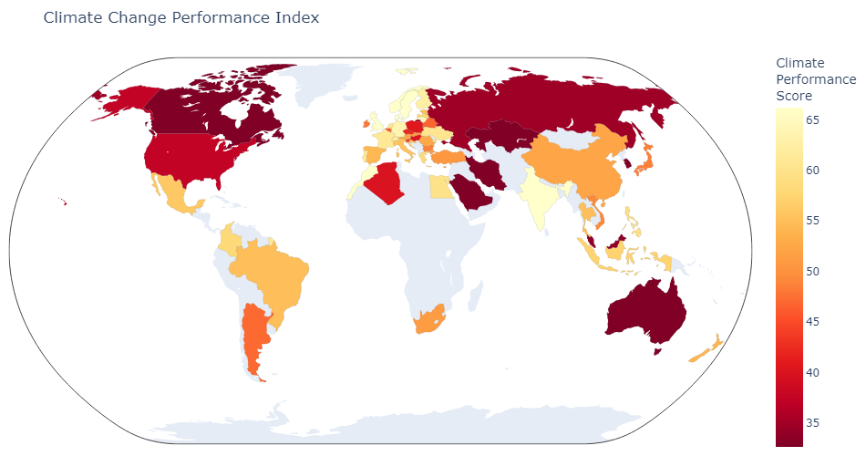
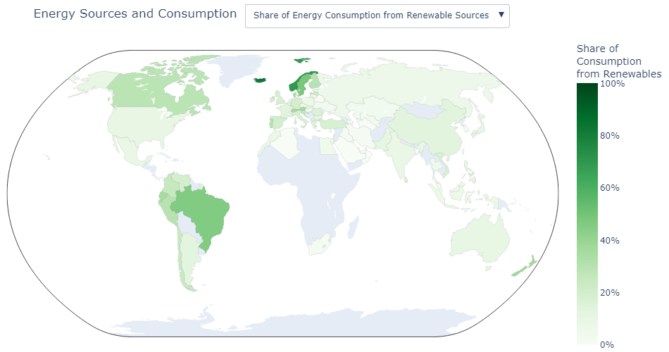

# A World View of Climate Protection
This project takes a deep dive into some of the factors that contribute to climate change and some relief efforts in different countries. It looks into emissions, energy consumption, renewable energy usage, and the climate change protection index by generating interactive world maps that show how countries are contributing to and working to reduce climate change.

## Usage
`climate_protection.ipynb` will generate all visualizations and can be run using a Jupyter Notebook-like interpreter.

If you are just interested in exploring the maps themselves without messing with the code, the `html_maps` directory contains HTML files for all of the maps. Opening the files in a web browser will allow you to view and fully interact with them. 

## Topics
This project looks into many different aspects of climate change and there are plans to cover much more. Currently, there are maps for the following:
- Climate Change Protection Index (https://en.wikipedia.org/wiki/Climate_Change_Performance_Index)
- Greenhouse Gas Emissions per Capita
- Methane Emissions per Capita
- Nitrous Oxide Emissions per Capita
- CO2 Emissions per Capita
- Share of Global CO2 Emissions
- Percent Growth of CO2 Emissions
- Primary Source of CO2 Emissions

## Example Maps
Climate Change Protection Index

Greenhouse Gas Emissions per Capita

CO2 Emissions per Capita

Share of Energy Consumption that comes from Renewable Sources

## Tools
- Python
- Jupyter Notebook
- Plotly
- Pandas

## Sources
Climate Change Protection Index data from https://en.wikipedia.org/wiki/Climate_Change_Performance_Index#2022_results

Emission data from https://www.kaggle.com/datasets/danielrpdias/co2-and-greenhouse-gas-emissions (originally from https://github.com/owid/co2-data)

Energy data from https://github.com/owid/energy-data
